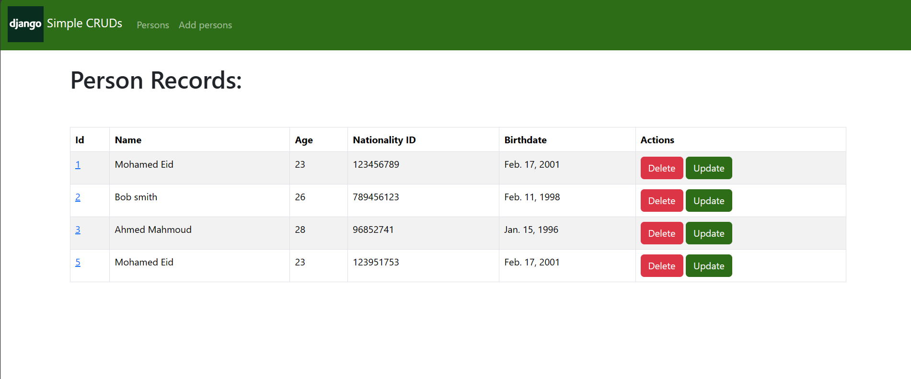
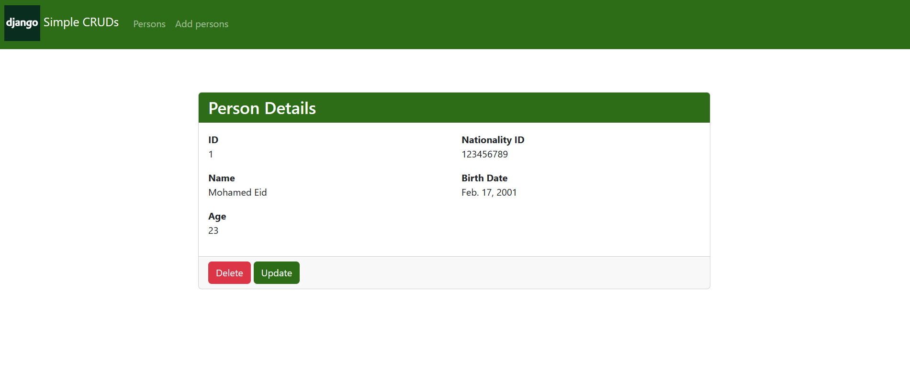
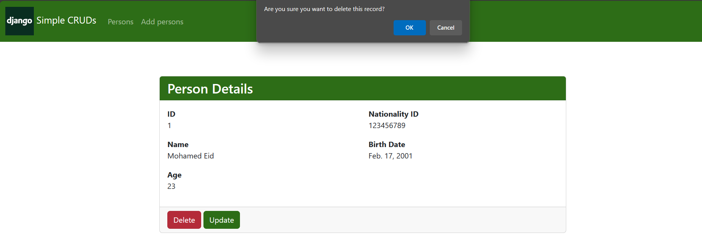

# DjangoSimpleCRUDs
Simple CRUD operations project using Django Framework

This is a simple CRUD (Create, Read, Update, Delete) application built using Django framework. It allows managing a list of persons with basic information.

## Live Demo
https://djangosimplecruds.pythonanywhere.com/

## Screenshots
Home Page (List Person Records):

Single Person Detail Page:

Create a New Person Record:

Update a Person Record:

Delete a Person Record:



## Installation:

To run the project locally, follow these steps:

1. Clone the repository:
   ```bash
   git clone https://github.com/3eid/DjangoSimpleCRUDs

2. Install the required dependencies:
   ```bash
   pip install -r requirements.txt

3. Apply migrations to create the database schema:
   ```bash
   python manage.py migrate
4. Create a superuser for accessing the admin interface:
   ```bash
   python manage.py createsuperuser
5. Run the development server:
   ```bash
   python manage.py runserver
6. Access the application in your browser at http://localhost:8000

## Usage

| Endpoint           | Description                                           |
|--------------------|-------------------------------------------------------|
| `/persons`         | Lists all the persons in the database.               |
| `/person`          | Shows details of a specific person.                  |
| `/persons/create`  | Allows adding a new person to the database.          |
| `/persons/{id}/update` | Allows editing details of an existing person.     |
| `/persons/{id}/delete` | Deletes a person from the database.                |


## Admin Interface
You can access the admin interface at http://localhost:8000/admin/ with the superuser credentials (username: admin, password: admin). This interface allows managing persons directly through a user-friendly interface.


